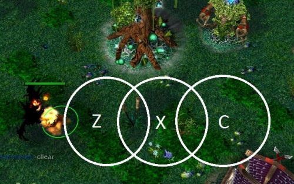

NeverMore
------------------

#### 影压

给予前方特定距离一定范围的aoe伤害

* 技能类型 主动技能
* 伤害类型 魔法伤害
* 学习后将获得三个独立的技能,分别对应不同距离的三种影压
* 魔法消耗 75
* 范围 275
* 距离 200(Z) 450(X) 700(C)

事实上影压的AOE区域比这个还小一些,不过我画大一点,这样你就能对影压在实际游戏中到底会压在哪里有一个大致印象,毕竟实际游戏还要考虑碰撞体积.